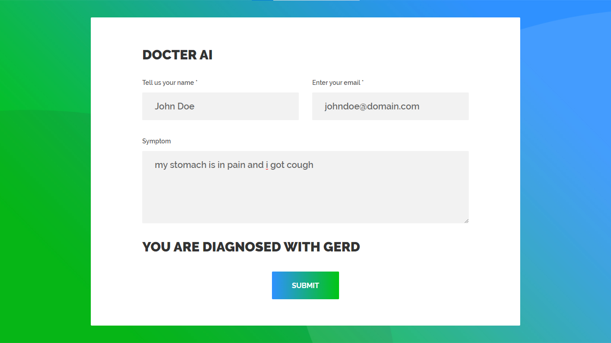

# [NLP] Diagnosing Disease Based On Symptoms
This is actually a text classfication task. The main idea of this project is people tell their symptom like they are tell a story and predict their disease

## Installation

`pip install scikit-learn pandas numpy nltk xgboost pickle flask`

`python app.py`

